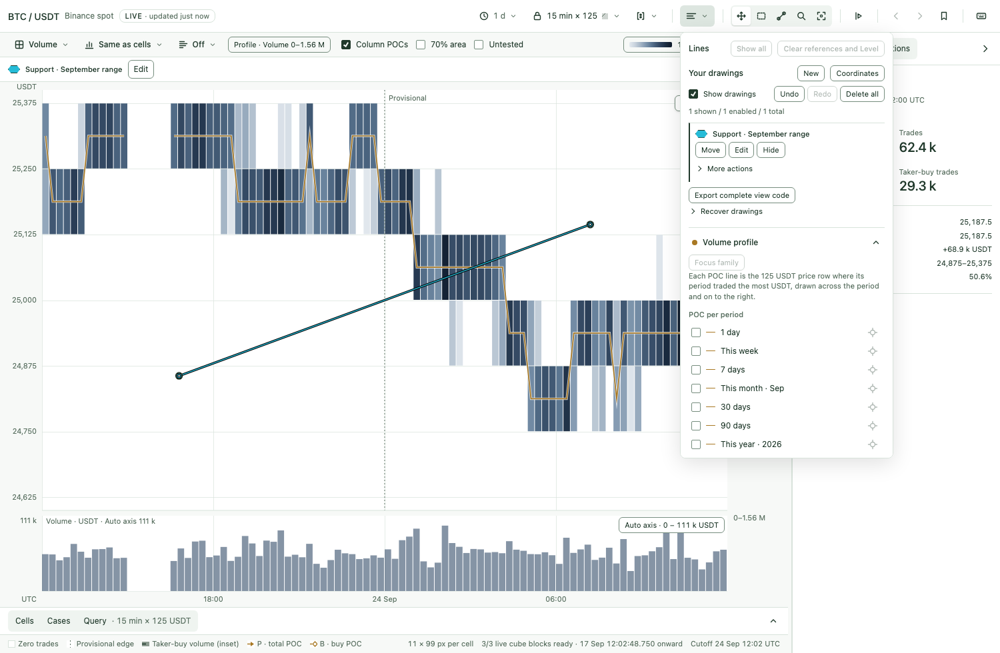
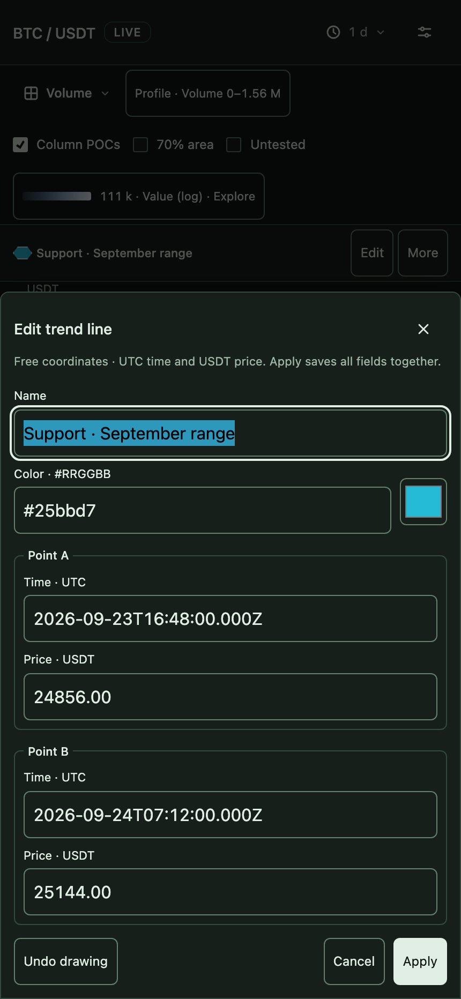

# Manual trend lines: candidate evidence

This is the single implementation of [PRD-0005 #65](https://github.com/Vaquum/Market-State-Cube-Explorer/issues/65) / [P5-S1 #66](https://github.com/Vaquum/Market-State-Cube-Explorer/issues/66), based on main `4900a00` including Candles. Free two-point solid lines use the existing tools, Lines inventory, exact editor and Views.

## Review surfaces

These are the implemented UI on the synthetic mini fixture. Names and RGB remain exact; the hollow hexagon identifies authored ink across themes. The phone editor uses the existing bottom-sheet form with 44 CSS-pixel controls.

## Verification

Final candidate receipts are being collected. The commands are `npm test`, `npm run golden:check`, `CONVERGENCE=1 npm run test:browser -- --workers=4`, and `python3 tools/build.py --check`. The drawing diagnostic reuses navigation instrumentation: `node tools/benchmark_drawings.mjs --candidate <sha> --out reports/drawing-diagnostic`.

Browser coverage includes exact geometry, direct gestures and cancellation, keyboard ownership, touch/pinch, duplicate choice, visibility/lock/delete/Undo, shared overlay budget, Cells/Candles/Lens/Inspect/replay, complete-code replacement, tab recovery, quota failures, two old-writer rollbacks and ordered named-view updates. Independent unit fixtures and market/wire goldens remain separate from implementation.

Local timing is diagnostic evidence, with pinned 0/20/200 objects, Volume/Candles, pan/endpoint edit/Play and five samples per case. It is not designated-machine performance certification. Human first-attempt sessions and physical-device recognition remain outstanding under the [operator checklist](operator-drawings.md); screenshots and automated tests do not complete them.
