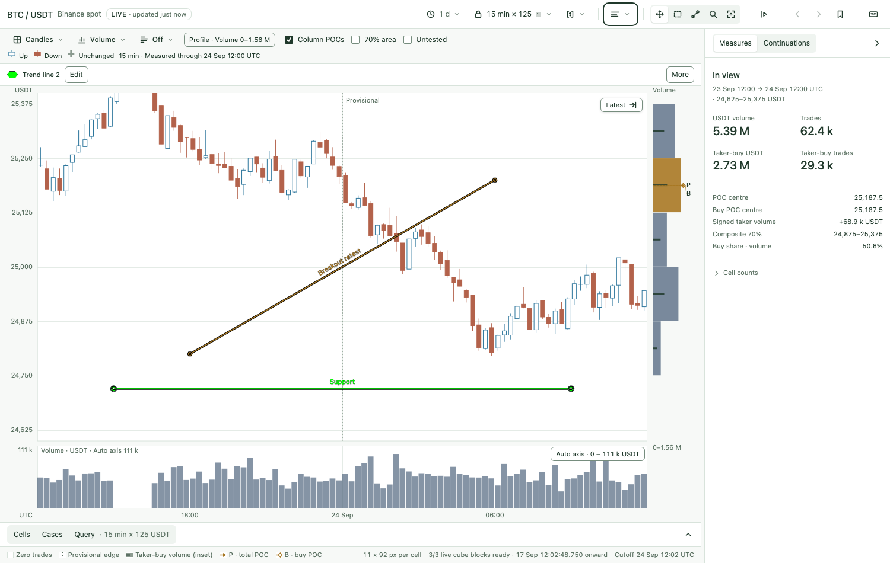
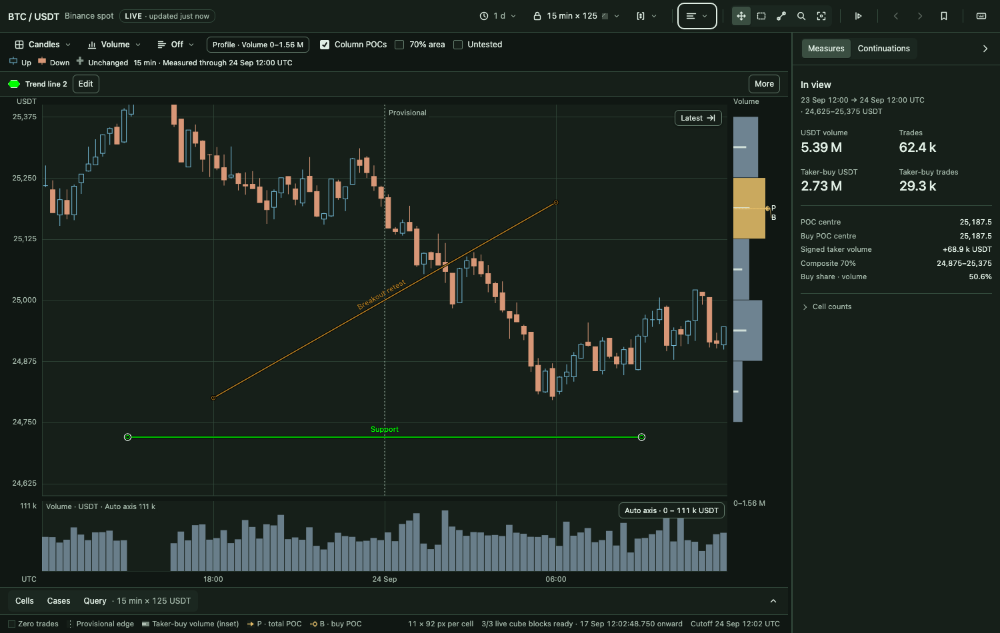
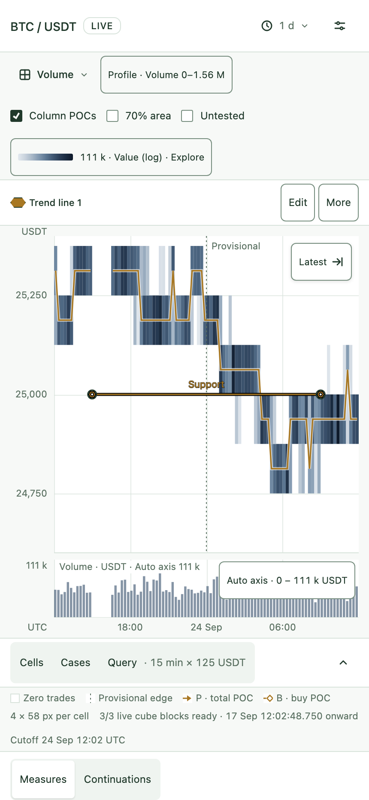

# Manual trend lines: candidate evidence

This is the single implementation of [PRD-0005 #65](https://github.com/Vaquum/Market-State-Cube-Explorer/issues/65) / [P5-S1 #66](https://github.com/Vaquum/Market-State-Cube-Explorer/issues/66), based on main `4900a00` including Candles. Free two-point solid lines use the existing tools, Lines inventory, exact editor and Views.

## Review surfaces

These are the implemented UI on the synthetic mini fixture. Names and RGB remain exact; the hollow hexagon identifies authored ink across themes. The phone editor uses the existing bottom-sheet form with 44 CSS-pixel controls.

## Verification

Candidate `3557543` passed **1,903 unit tests** (six existing skips) and **all 683 browser tests** on the committed page with Playwright1.63.0 / Chromium153.0.8010.12, macOS arm64 / Node23.10.0. Numerical/wire goldens, JavaScript syntax, generated-page parity and diff checks passed. Commands: `npm test`, `npm run golden:check`, `CONVERGENCE=1 npm run test:browser -- --workers=4`, and `python3 tools/build.py --check`. The drawing diagnostic reuses navigation instrumentation: `node tools/benchmark_drawings.mjs --candidate <sha> --out reports/drawing-diagnostic`.

Browser coverage includes exact geometry, direct gestures and cancellation, keyboard ownership, touch/pinch, duplicate choice, visibility/lock/delete/Undo, shared overlay budget, Cells/Candles/Lens/Inspect/replay, complete-code replacement, tab recovery, quota failures, two old-writer rollbacks and ordered named-view updates. Independent unit fixtures and market/wire goldens remain separate from implementation.

Local timing is diagnostic evidence, with pinned 0/20/200 objects, Volume/Candles, pan/endpoint edit/Play and five samples per case. It is not designated-machine performance certification. Human first-attempt sessions and physical-device recognition remain outstanding under the [operator checklist](operator-drawings.md); screenshots and automated tests do not complete them.

## PR #69 review corrections (2026-10-05)

The review corrections give duplicated tabs complete independent session snapshots;
cap shared recovery history at24 ordinary and8 prior replacements; compact obsolete
named payloads through atomic immutable per-name publications; support secure UUIDs
without `randomUUID`; make clean editor Undo reverse committed work while dirty/new
editors cancel only; and apply the chart successfully before committing imported
objects/history. Failed chart application restores the prior camera/settings. Retry
clears its drawing-specific failure notice, later failures remain visible, and row
removal restores valid focus. Unreadable session originals copy verbatim before a new
save may replace them; failed copying retains the original. Named-View UI reads now
use one snapshot for status, entries and deletion baseline, preserving a concurrent
first publication through the next acknowledged save. Default array reads now return
the same legacy entries used by the deletion baseline. Failed mutation reads block
saving until a successful reread; diagnostic reads leave that guard unchanged.

All **1,921 local unit tests** pass (six existing skips), including 31 storage cases for real
publication interleaving, hundreds of document saves/imports, inherited snapshot expiry,
secure UUID fallback, compaction, corruption, cached immutable values and retry races.
Eleven new browser regressions cover Undo/cancel/focus, both rejected-application routes,
quota retry and two-tab state. Three core regressions reproduce the defects on
pre-review `7409f30`; the first-publication race reproduces on `d9ad67f`. All eleven
review regressions pass on the corrected working page. Four additional unit
regressions reproduce legacy-add loss and recovered-read loss before their fixes.
The old Undo finding is independently rechecked: all six relevant committed-page
browser tests pass. Final convergence uses the committed generated page.
The final branch's complete browser and build/golden receipts are linked in
[PR #69 checks](https://github.com/Vaquum/Market-State-Cube-Explorer/pull/69/checks).
Recovery and named-publication details, including small deletion markers retained for
paused publishers, are in [the API contract](drawing-api.md). The diagnostic below
remains the measured earlier candidate; human operator sessions remain outstanding.

## Optional trend-line labels

Edit → Label is empty by default and independent of the inventory name. Nonempty
plain text inherits the line RGB and existing11px chart font. It reads upright,
parallel to the line, with its ink bottom6CSSpx above the visible segment and a thin
neutral contrast outline. There is no plate, pill or separate hit target.

Placement centers on the main plot's clipped segment, sliding only along that line
when needed to keep complete ink inside the plot. Long labels ellipsize at grapheme
boundaries; the full text stays in Edit and snapshots. A segment too short or too
close to the upper edge omits its unfit label. Lens uses the same placement through
regional clipping. The line and its rotated text share one overlay-budget candidate;
narrow parallel strips charge the text footprint without a diagonal bounding box.
Layout, including omitted labels, is measured once per frame.

Apply commits the label together with all other editor fields; preview, Cancel,
Cancel draft, Undo/Redo, lock, visibility, duplication, reload, recovery, complete
codes and named Views keep the existing drawing transaction/persistence rules.
The [API contract](drawing-api.md) covers normalization and old-reader rejection.
The [operator checklist](operator-drawings.md) adds the human label workflow.

## Local diagnostic receipt

Candidate `3557543`, 90 samples (18 cases × five), Apple M1 Max / macOS arm64, Chromium153.0.8010.12. All20 actual endpoint edits applied, made zero `/cube/*` reads, and produced painted samples; no page errors. Worst endpoint-edit input-to-paint p95 was23.5ms; worst pan/edit p95 was23.9ms. Frame-interval p95 stayed at or below16.8ms.

Maximum per-sample draw p95 in milliseconds, across Volume/Candles:

| Action | 0 drawings | 20 drawings | 200 drawings |
| --- | ---: | ---: | ---: |
| Pan | 1.6 | 3.6 | 11.1 |
| Endpoint edit (0 is empty-chart pan) | 1.6 | 3.7 | 6.5 |
| Play | 6.7 | 9.2 | 14.7 |

Dense pan/Play exceeded the inherited10ms draw target. One20-line Candles pan sample had1/60 intervals over33.3ms (1.67%, above the1% target). Volume Play's first input-to-paint p95 was218.4ms with0 lines and225.9ms with200; this metric includes waiting for the replay tick. These are local observations, without paired A/A floors or designated-machine certification; they add no automatic merge gate.

Page SHA256: `e394d3e0d12fc536e00c7aa7edbdb965c025dff309daad2ed531b9dd32f867af`. Config SHA256: `a4643a0b47ec2e1646040c2a2a63bb97d815999b29f387804d252a15e02aec25`. Raw samples, frames, inputs, request logs and host/browser/config metadata remain in `reports/drawing-diagnostic-final/raw.json` (ignored local output).
